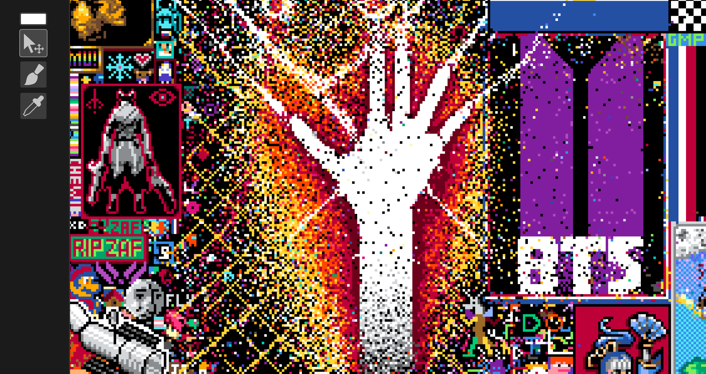

# pixels

A Rust desktop client **and** library for [pixels](https://github.com/yazilimcilarinmolayeri/pixels), a collaborative, [r/place](https://en.wikipedia.org/wiki/R/place)-style pixel canvas built for a community event.

You can run the full GUI client to draw on the shared canvas, or pull in `pixels-canvas` as a plain library and script the canvas yourself with no window and no rendering, just the API.



## Features

- **Live canvas** rendered with [macroquad](https://macroquad.rs), auto-refreshing from the server every few seconds
- **Four tools:** move/pan, brush (paint a pixel), color picker (sample a pixel), and image placer (stamp a local image)
- **egui side panel** for color selection and tool switching, with a tooltip while you're on cooldown
- **Layered canvas** where the live server layer and a translucent image-preview layer are composited via alpha blending
- **Server cooldown** handled end-to-end, dimming the canvas and surfacing the remaining wait
- **Reusable core** so the networking, color, and canvas logic live in dependency-light library crates

## Workspace

The project is a Cargo workspace of three crates, layered bottom-up:

| Crate | Kind | Purpose |
| --- | --- | --- |
| [`pixels-util`](pixels-util) | library | Core primitives: `Color` (conversions, hex, alpha blend), the `Pixels` grid, and `Cooldown` |
| [`pixels-canvas`](pixels-canvas) | library | `Canvas`, `Layer`, `Element`, and the HTTP `Client` that talks to the server |
| [`pixels-interface`](pixels-interface) | binary | The GUI app: macroquad (render) + egui (panel) + bevy_ecs (systems) |

## Running the client

```sh
cargo run -p pixels-interface -- <refresh-token>
```

On launch you're asked whether to select a PNG/JPEG to paste onto the canvas; pick one to enable the image placer tool.

**Controls**

| Action | Input |
| --- | --- |
| Move / pan | `M`, then drag |
| Brush | `B`, then click |
| Pick color | `I`, then click |
| Place image | `P`, then click |
| Zoom | scroll wheel |

## Using `pixels-canvas` as a library

`pixels-canvas` has no GUI dependencies. It authenticates, fetches the canvas, and sets pixels on its own. Add it as a path (or git) dependency and drive the canvas directly:

```rust
use pixels_canvas::prelude::*;
use pixels_util::color::Color;

fn main() -> Result<(), CanvasError> {
    // Authenticates with your refresh token and pulls the current canvas.
    let mut canvas = Canvas::new(std::env::var("REFRESH_TOKEN").unwrap())?;

    println!("canvas is {}x{}", canvas.width(), canvas.height());

    // Read a pixel.
    if let Some(color) = canvas.get_pixel(10, 10) {
        println!("pixel (10,10) = #{}", color.to_hex(ColorMode::RGB));
    }

    // Write a pixel (respects the server-side cooldown).
    match canvas.set_pixel(10, 10, Color::from_rgb(255, 0, 0)) {
        Ok(()) => println!("placed!"),
        Err(CanvasError::Cooldown(secs)) => println!("wait {secs}s"),
        Err(CanvasError::Client(e)) => eprintln!("request failed: {e}"),
    }

    // Refresh the local copy from the server.
    canvas.update_main_layer()?;
    Ok(())
}
```

Key entry points:

- `Canvas::new(refresh)` authenticates and loads the canvas
- `Canvas::get_pixel` / `set_pixel` read and write single pixels
- `Canvas::update_main_layer` re-fetches the live canvas from the server
- `Canvas::get_layers_merged` returns the composited canvas for rendering
- `Color` / `Pixels` (from `pixels-util`) work with pixel data offline

## Building

```sh
cargo build            # all crates
cargo run -p pixels-interface -- <refresh-token>
```

## License

See [License.md](License.md).
